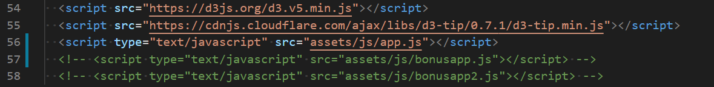

# D3-challenge
Wk16 D3 Dabbler - Monash Data Analysis Bootcamp
================================================

## About the Project
This project consists of 3 different solutions to generating a scatter plot graphic, each with increased functionality.  In each solution, the graphic is created between two data variables and uses both html and a Javascript file, with SVG and d3js plugins.  The scatter plot pulls off a single dataset, data.csv using the d3.csv function.  The dataset itself is based on the 2014 ACS 1-year US census estimates: [https://data.census.gov/cedsci/all?q=2014%20ACS%201-year%20estimates](https://data.census.gov/cedsci/all?q=2014%20ACS%201-year%20estimates) and includes data on rates of income, obesity, poverty, etc. by US state.

In the first solution, [app.js](./assets/js/app.js), a static scatterplot is generated between two variables Healthcare vs. Poverty.  In the second solution, [bonusapp.js](./assets/js/bonusapp.js), interactivity is introduced with users given the ability to toggle between 3 X-axis and 3 Y-axis options.  Selection of an option on either axis, the relevant axis is re-scaled to fit the new data range and the circle and cirlce text locations of the plot transition to new locations.  In the final solution, [bonusapp2.js](./assets/js/bonusapp2.js), d3 tool tips are added, using the d3-tip.js plugin developed by [Justin Palmer](https://github.com/Caged) to include the name of the state, as well as the name of each X-axis and Y-axis selected and their respective values.

Note: testing was done using `python -m http.server`to run the visualization. This hosted the page at `localhost:8000` in my local web browser.

## Usage

- To view the individual solutions requires selecting the specific '<script> src ' in the [index.html](index.html) file
  

## Built With

* [JavaScript](https://developer.mozilla.org/en-US/docs/Web/javascript)
* [d3js](https://d3js.org/)

## Acknowledgements

